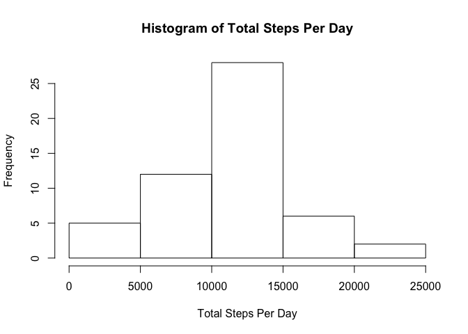
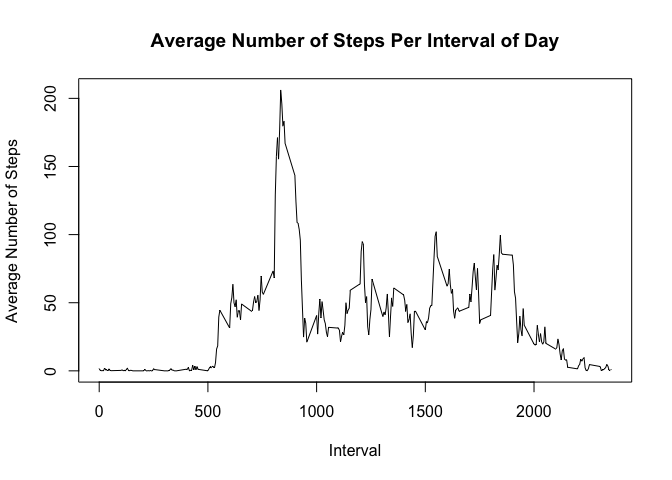

# Reproducible Research: Peer Assessment 1

```r
# defined a function to help distinguish weekdays from weekends
dateToWDay <- function (x){
    sta <- wday(x)
    if(sta == 1 || sta == 7)sta <- "weekend"
    else sta <- "weekday"
    sta
}
```

## Loading and preprocessing the data

<p>In this first section, we present the sequence of tasks used to load and prepare data to analysis.</p>


```r
library(lubridate)
library(dplyr)
```

```
## 
## Attaching package: 'dplyr'
## 
## The following objects are masked from 'package:lubridate':
## 
##     intersect, setdiff, union
## 
## The following objects are masked from 'package:stats':
## 
##     filter, lag
## 
## The following objects are masked from 'package:base':
## 
##     intersect, setdiff, setequal, union
```

```r
df_steps <- read.csv("activity.csv",na.strings = "NA",stringsAsFactors = FALSE)
df_steps$date <- ymd(df_steps$date)
df_steps$dayFactor <- lapply(df_steps$date,FUN = dateToWDay)
```

<p> The steps required were load libraries *lubridate* and *dplyr*
primarily, followed by reading the csv file (indicating NA values as string *NA*) and mutate the table to include a flag *dayFactor* in order to assist in later
analysis.
</p>

## What is mean total number of steps taken per day?


```r
df_steps_gp <- group_by(df_steps, date)
df_steps_gp <- summarise(df_steps_gp, total = sum(steps))

meanValue <- mean(df_steps_gp$total,na.rm = TRUE)
medianValue <- median(df_steps_gp$total,na.rm = TRUE)
```

<p>Given the data is loaded and transformed as needed to perform calculations, as seens bellow, the mean and median numbers of steps taken per day are:</p>


```r
print(paste("Mean Value is",round(x = meanValue,digits = 2),sep = " "))
```

```
## [1] "Mean Value is 10766.19"
```

```r
print(paste("Median Value is",medianValue,sep = " "))
```

```
## [1] "Median Value is 10765"
```

<p>Also, a histogram was created to illustrate the frequency of steps.</p>


```r
hist(df_steps_gp$total,main = "Histogram of Total Steps Per Day",xlab = "Total Steps Per Day")
```

 

## What is the average daily activity pattern?


```r
df_steps_gp <- group_by(df_steps, interval)
df_steps_gp <- summarise(df_steps_gp, total = round(mean(steps,na.rm=TRUE),2))
```

<p>In an effort to establish a pattern of steps, the time series bellow indicates the average number of steps taken per interval in a day.</p>


```r
plot(df_steps_gp$interval, df_steps_gp$total,type="l", xlab = "Interval", ylab = "Average Number of Steps", main = "Average Number of Steps Per Interval of Day")
```

 


<p>Also, as can be calculated, the interval with the highest average number of steps is:</p>


```r
maxInterval <- (df_steps_gp[order(df_steps_gp$total,decreasing = TRUE),])[[1]][[1]]

print(paste("Interval with the Highest Average Number of Steps:",maxInterval,sep = " "))
```

```
## [1] "Interval with the Highest Average Number of Steps: 835"
```

## Imputing missing values


## Are there differences in activity patterns between weekdays and weekends?
