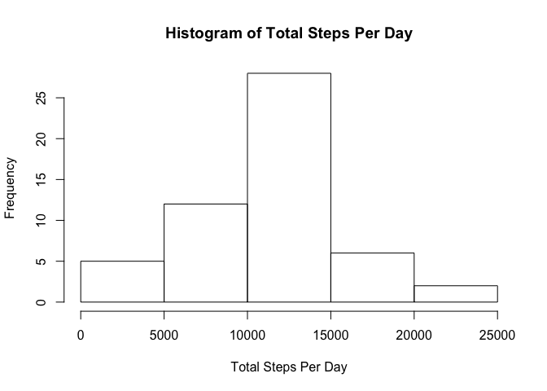
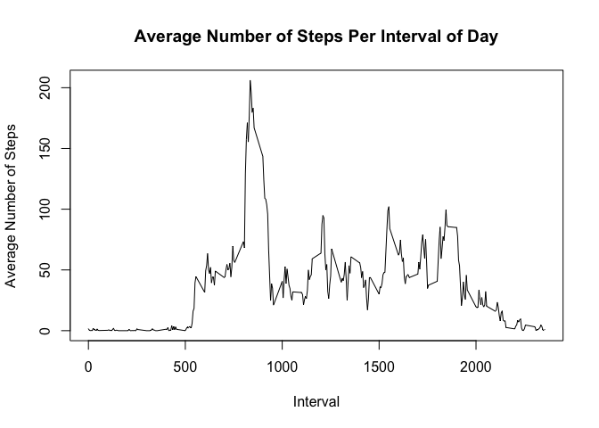
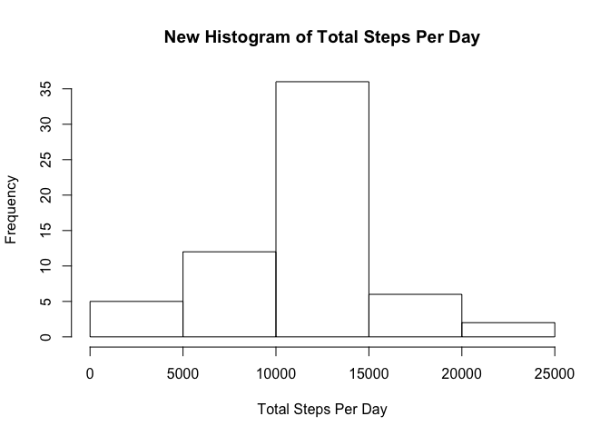
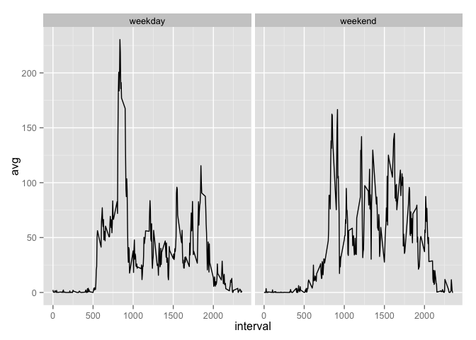

# Reproducible Research: Peer Assessment 1


## Loading and preprocessing the data

<p>In this first section, we present the sequence of tasks used to load and prepare data to analysis.</p>


```r
library(lubridate)
library(dplyr)
library(ggplot2)

df_steps <- read.csv("activity.csv",na.strings = "NA",stringsAsFactors = FALSE)
df_steps$date <- ymd(df_steps$date)
df_steps$dayFactor <- dateToWDay(df_steps)
```

<p> The steps required were load libraries *lubridate* and *dplyr*
primarily, followed by reading the csv file (indicating NA values as string *NA*) and mutate the table to include a flag *dayFactor* in order to assist in later
analysis.
</p>

## What is mean total number of steps taken per day?


<p>Given the data is loaded and transformed as needed to perform calculations, as seens bellow, the mean and median numbers of steps taken per day are:</p>

- Mean Value is <b>1.076619\times 10^{4} </b>
- Median Value is <b>10765 </b>

<p>Also, a histogram was created to illustrate the frequency of steps.</p>

 

## What is the average daily activity pattern?


<p>In an effort to establish a pattern of steps, the time series bellow indicates the average number of steps taken per interval in a day.</p>

 

<p>Also, as can be calculated, the interval with the highest average number of steps is <b> 835 </b> .</p>

## Imputing missing values


<p>Unfortunately, this data set contains many missing values. As calculated bellow, the total number of missing values for steps in any interval is<b> 2304 </b>.</p>

<p>Given that number and in order to fullfil all data, those missing values will be <b>replaced</b> by the *average/mean number* of steps of that given interval. The purpose of doing the substitution for such number is to approximate the condition of the unknown event (the *NA* value) to the observed in other days for that interval.</p>


<p>With the new set of values updated, we recalculated mean and median values of steps taken per day and ploted a new histogram, seen bellow:</p>

- Mean Value is <b>1.076618\times 10^{4} </b>
- Median Value is <b>1.076613\times 10^{4} </b>


 

<p>By performing the substitution of *NA* values for the average number of steps per interval calculated initially, as we can observe, both new mean and median values are very close to the ones first computed. Also, both histogram graphics provide a similar behaviour.</p>

## Are there differences in activity patterns between weekdays and weekends?

<p>Finally, we created a new plot to demonstrate the difference in steps taken per interval.</p>

<p>As shown bellow, the average number of steps is concentrated in early morning hours in weekdays, while, in the weekend, towards mid-day.</p>

 

